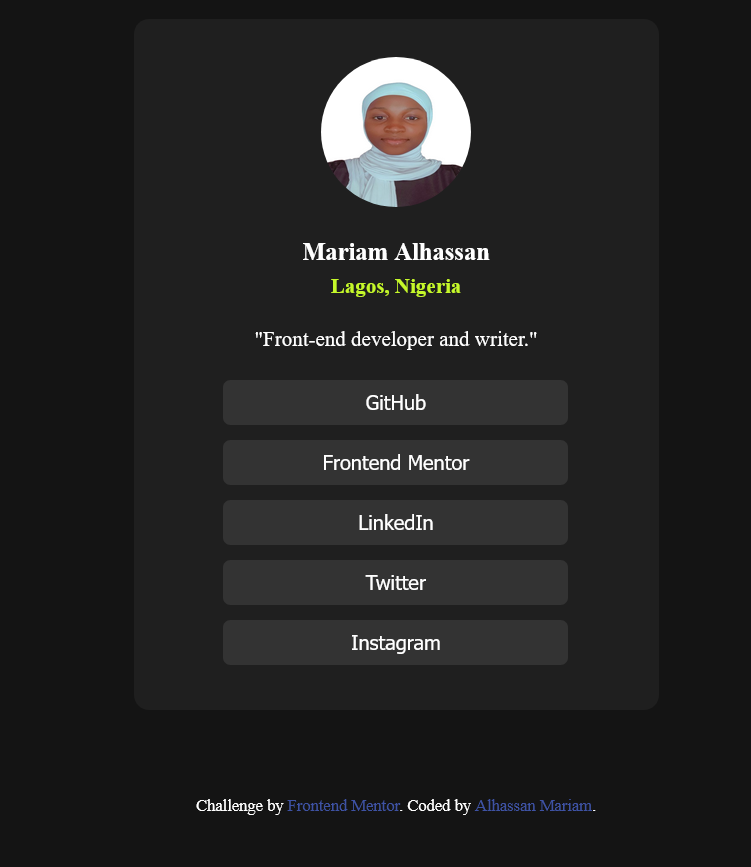

# Frontend Mentor - Social links profile solution

This is a solution to the [Social links profile challenge on Frontend Mentor](https://www.frontendmentor.io/challenges/social-links-profile-UG32l9m6dQ). Frontend Mentor challenges help you improve your coding skills by building realistic projects. 

## Table of contents

- [Overview](#overview)
  - [The challenge](#the-challenge)
  - [Screenshot](#screenshot)
  - [Links](#links)
- [My process](#my-process)
  - [Built with](#built-with)
- [Author](#author)

## Overview

### The challenge

Users should be able to:

- See hover and focus states for all interactive elements on the page

### Screenshot

### Links

- Solution URL: [AlhassanMariam](https://github.com/AlhassanMariam/social-links-profile)
- Live Site URL: [social-links-profile](https://alhassanmariam.github.io/social-links-profile/)

## My process

### Built with

- Semantic HTML5 markup
- CSS
- CSS Grid

## Author

- Website - [Alhassan Mariam](https://www.your-site.com)
- Frontend Mentor - [@AlhassanMariam](https://www.frontendmentor.io/profile/AlhassanMariam)
- Twitter - [@Maryamabiolar](https://www.twitter.com/Maryamabiolar)